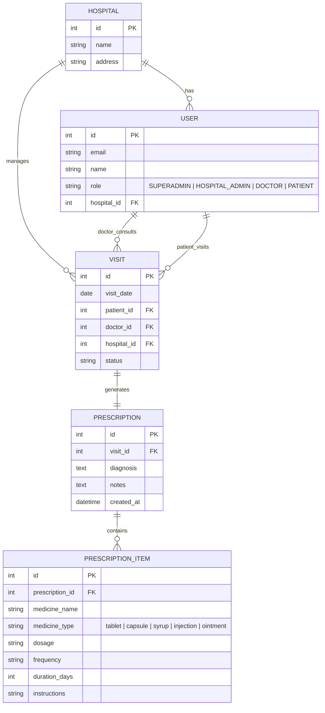

# ER Diagram – MedFlow

The following ER diagram represents the core data model of MedFlow.

```mermaid

erDiagram

    USER {
        int id PK
        string email
        string name
        string role  "SUPERADMIN | HOSPITAL_ADMIN | DOCTOR | PATIENT"
        int hospital_id FK
    }

    HOSPITAL {
        int id PK
        string name
        string address
    }

    VISIT {
        int id PK
        date visit_date
        int patient_id FK
        int doctor_id FK
        int hospital_id FK
        string status
    }

    PRESCRIPTION {
        int id PK
        int visit_id FK
        text diagnosis
        text notes
        datetime created_at
    }

    PRESCRIPTION_ITEM {
        int id PK
        int prescription_id FK
        string medicine_name
        string medicine_type  "tablet | capsule | syrup | injection | ointment"
        string dosage
        string frequency
        int duration_days
        string instructions
    }

    %% Relationships
    HOSPITAL ||--o{ USER : has
    HOSPITAL ||--o{ VISIT : manages

    USER ||--o{ VISIT : "doctor_consults"
    USER ||--o{ VISIT : "patient_visits"

    VISIT ||--|| PRESCRIPTION : generates
    PRESCRIPTION ||--o{ PRESCRIPTION_ITEM : contains

```
